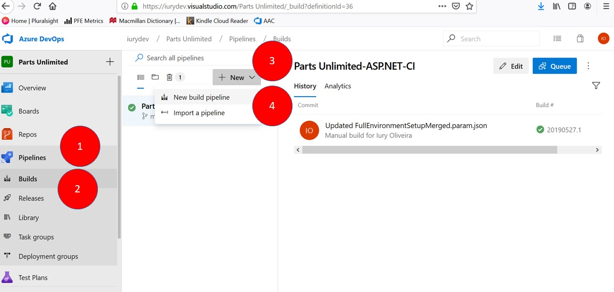
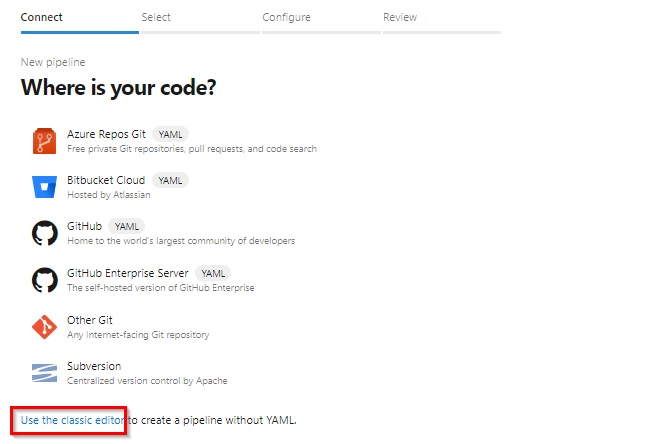
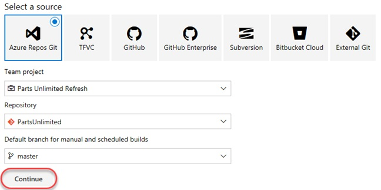
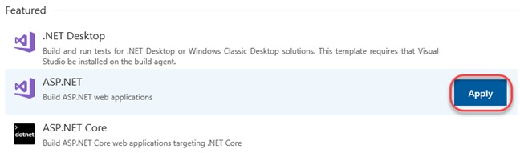
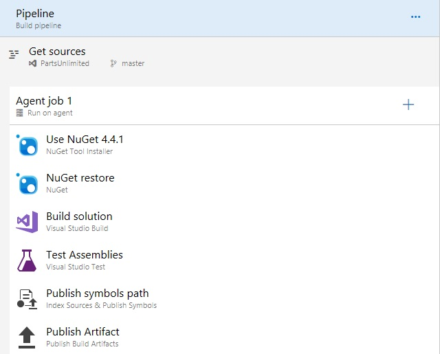
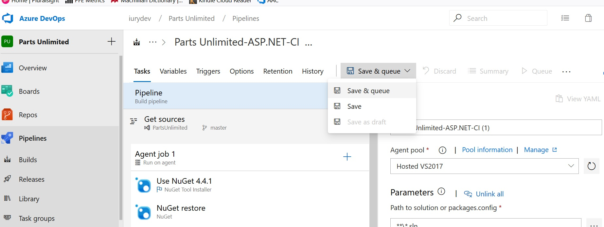
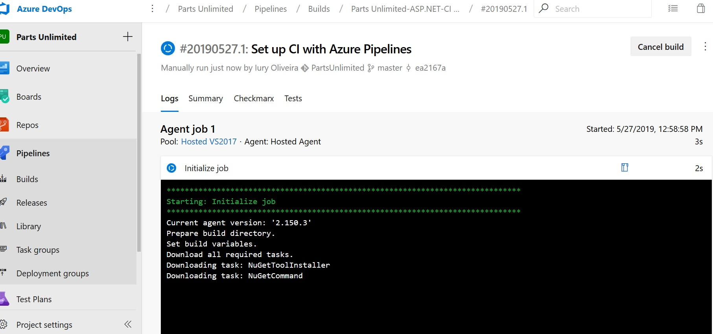

# Creating a Basic build pipeline from a template:

In this lab we will learn how to configure continuous integration and Continuous deployment for your Applications using Build and Release pipelines in Azure DevOps environment.

## Creating a Basic build pipeline from a template:

	Go to Azure DevOps Project:

	1. Go to Azure DevOps Pipeline

    2. Click on Builds
	
    3. Select New
	
    4. Select New Build Pipeline

The default option for build pipelines involves using YAML to define the process.For this lab, click use the classic editor. 

 The first thing you’ll need to do is to configure the source repository. Every major platform is available, but the default options are all we need here. This build will use the master branch of the PartsUnlimited repo. Leave the defaults and click Continue.

Locate the ASP.NET template and click Apply to apply this template to the build definition. Note that there are many options that should cover all of our mainstream scenarios. For our purposes here, we’ll just build the project using the baseline ASP.NET template.

The process for this build pipeline is easy to follow. After getting the source, Azure DevOps will use NuGet to restore any dependent packages. Then, the project will be built and tested. The results will then be published to the configured target.

After configure the build, just click on Save & queue

A build will be started and you can check the result.

